# Metamaterial_absorber

##
## **Preparations**
##

## 20/04-22
1. Setting up git repository and downloading necessary software and documents to prepare for the project.
* Added old_files folder to repo
* Installed Freecad and added Cadquery extension

## 21/04-22
* Set up the correct enviroment to run absorber codes with Cadquery2 with Conda
* Tested the step files with Freecad 0.19

##
## **Official start**
##
## 13/06-22
### Plan:
1. Try 3D-printing something
2. Start learning about cadquery methods 
3. Start to make basic geometries

### Did: 
1. Printed a violin test mo
and learned to: 
* Send things to formlabs printer via preform. 
* Preparing the printer for printing and removing the print.
* Washing in isopropanol manually and with machine and also curing it.

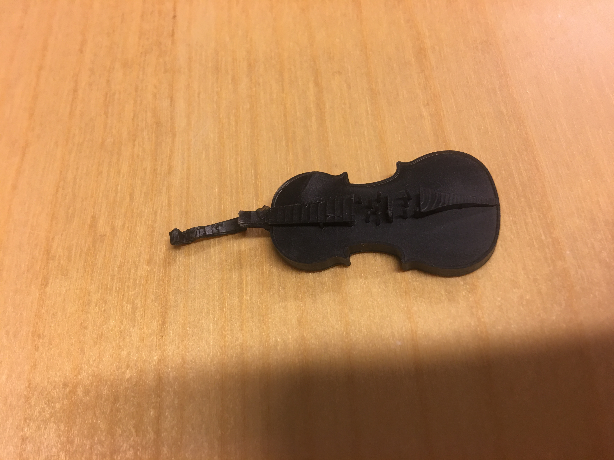
fig. testprint of violin. (Violin did not hold, really fragile)

2. Looked at different examples of basic geometries of different cadquery objects.
* Learned basic methods in cadquery.

3. Tried to make a basic pyramid.

### Questions \& To do:
* Learn to refill the printer with liquid.
* Learn how to move and rotate in Cadquery workplane to start iterating. (Look into .add, .rotate, .union, .translate methods)

## 14/06-22

### Plan:
1. Learn .translation, <del>.rotation</del>, .add methods
2. Make a 9x9 pyramid absorber
<del> 3. Make a dogleg absorber </del>
4. Try other patterns (Hilbert, translation + rotation)
* start with simple cross section, (rectangular --> triangular --> dogleg)
* start with small section --> larger hilbert curves

### Did: 
1. Looked at many example codes and learned to use methods .add and .translation.
2. Printed out a 30x30 pyramid wall with 1 mm between pyramids. 

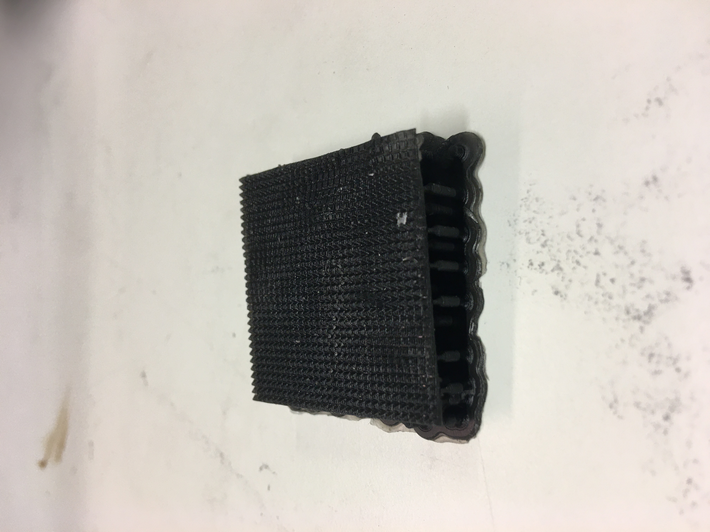
Figure1. print of pyramid wall from the side.  

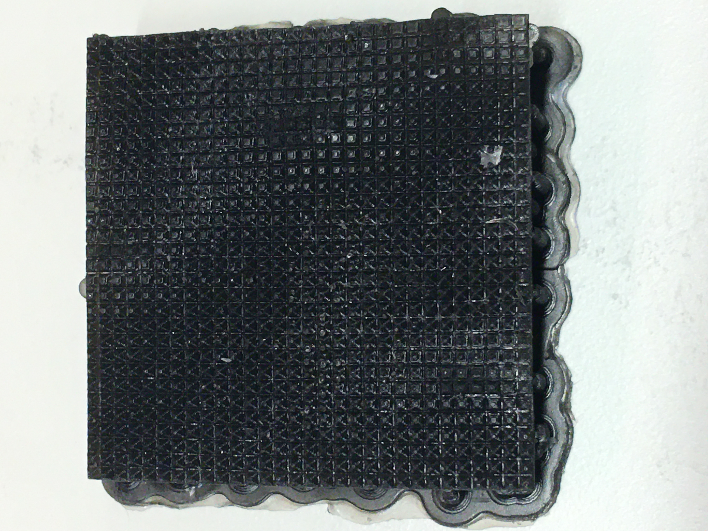
Figure2. print of pyramid wall from above.  

3. Started to print 25 25x25 updated pyramid walls to check printer properties.

### Questions and to do:
* What is/ how to make different types: Workplane, solid
* Some parts of the prints gets deformed, also pyramid heads are not sharp in different regions. Some supports are missing and noise during print.
* We could make some test patterns and print those 3-5 times to see if deformation happen on same spot or different.

## 15/06-22

### Plan:
1. Study the print.
2. Finish writing the geometry file, add dog_leg later.
3. Start making Hilbert curve with blocks, continue to pyramid which requires corner sections, etc.

### Did:
1. We studies the print and looks like the print is very dependent on the film quality and condition. We should change to a new film for optimal prints. The metal plating seemed fine. 

  

fig. printed lots of absorbers to fit the printing plate to check deformations.

2. Finished the geometry class file and also written in functions depending on use, class is more difficult to use.

3. Written the code to generate hilbert curves with L-system and drawed it with turtle. I'll continue with integrate it with walls.
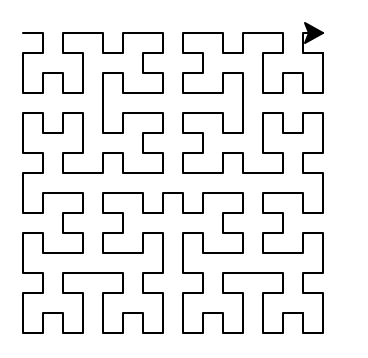
fig. generated hilbert curve with turtle graphics.

### To do:
1. have code divided by the classes: cross_section, wall_segments, pattern 

### Comment:
1. Print with tilted objects so that the vertikal lines don't deform as easily. 

## 16/06-2022
### Plans:
1. Create different wall section, start with <del>rectangular</del> (no need because of overlap) and triangular. (doubble symmetry vs single symmetry vs no symmetry (dogleg))
<del> 2. Integreate block cross sections with hilbert curve generation. </del>
3. Continue with trangular cross section.
4. Design corner and side wall section for dogleg .
5. Integrate dogleg with hilbert curve. (start with one sided and later matched sides)

### Did:
1. Wrote code to create wall side and corner for triangular cross section.
3. Integrated it with hilbert generating code prepared for printing.

fig. generated hilbert curve as stl file.

## 17/06-2022
### Plans: 
1. Print the hilbert curve prototype
2. Restructure the code
3. <del>Start workig with the dogleg cross section in two parts.</del> (Hilbert curve not needed, easier to make other patterns?)
4. Test and look at corner section to see potential problems.

### Did:
1. Printed the print which looks good.
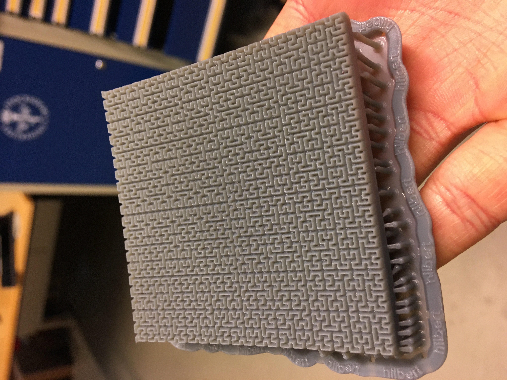
fig. printed out hilbert curve.

2. I've now restructured the code to add modification and more pattern/cross section. 
The corner build might need modification for more complicated cross sections

### Plans for next week:
1. Look at dogleg corners or rotations and look at potential problem or solution.

## 20/06-2022
### Plans:
1. Read the dogleg papaer.
2. Make dogleg side and then corner
3. Read meta absorber paper from Gagan

### Did:
1. Looked through dogleg design and will continue reading details later.
2. Made dogleg side but still working on corner

  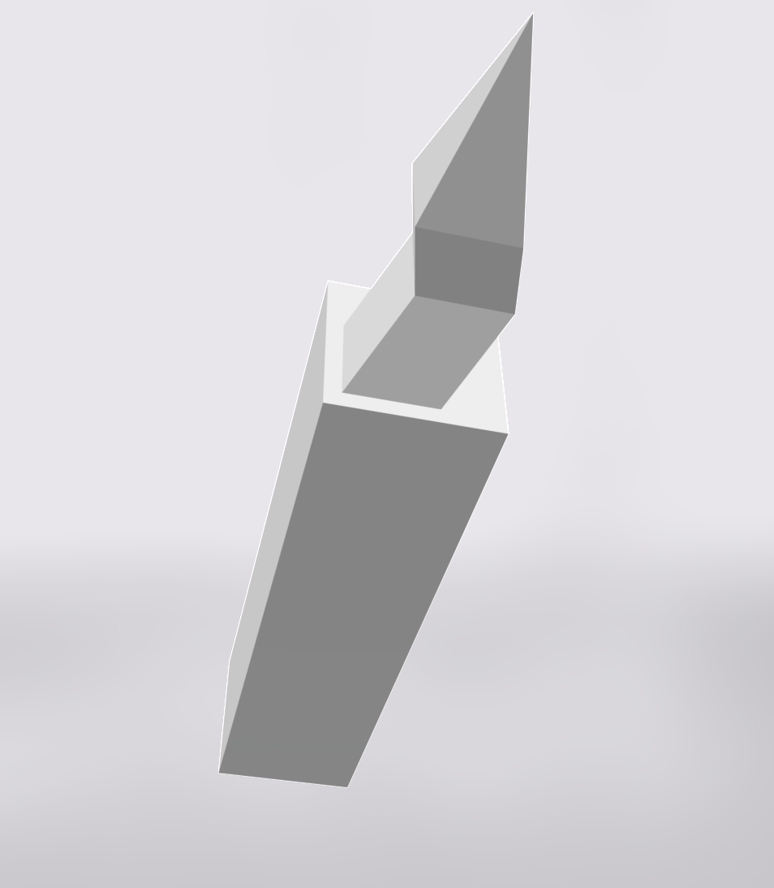
  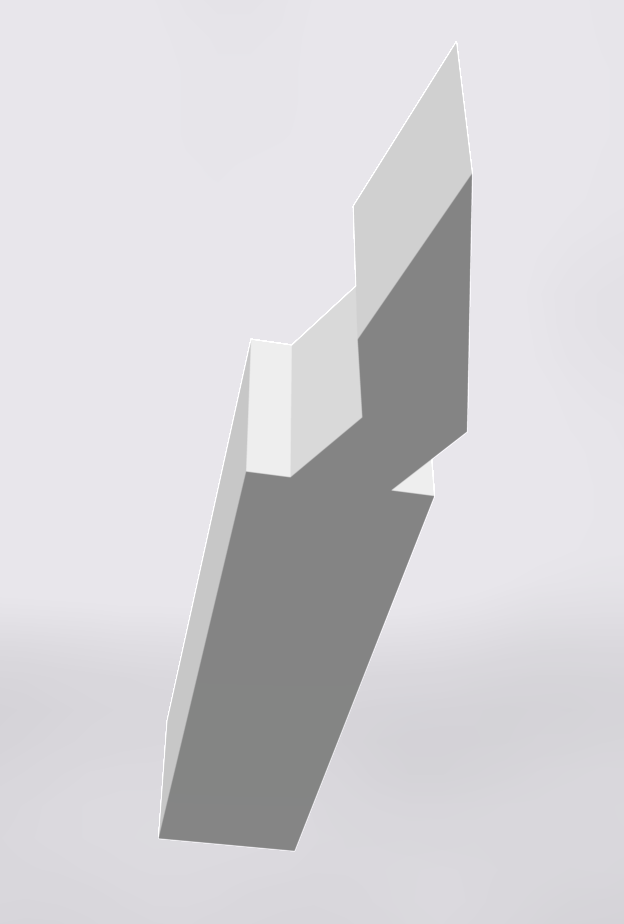
  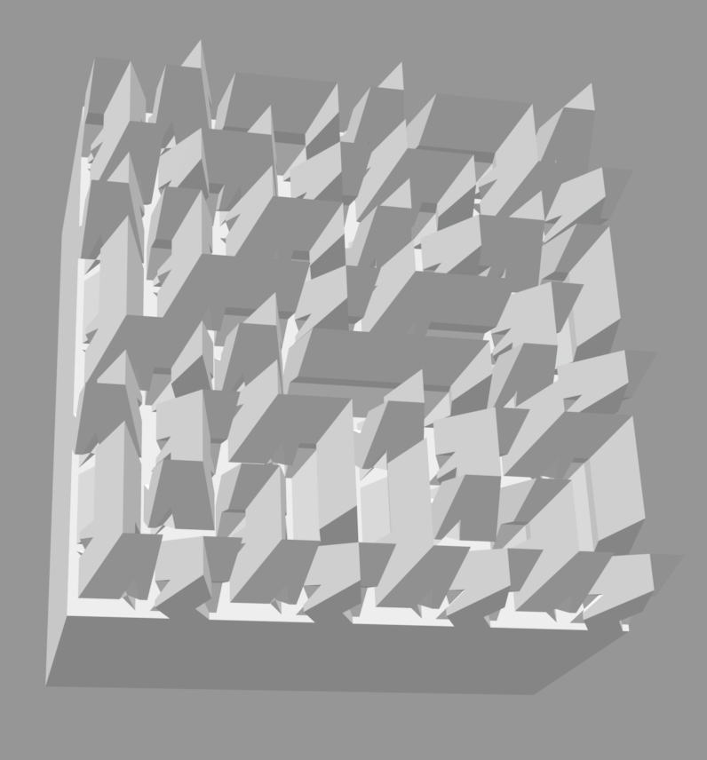

fig left. dogleg intersection. &nbsp;&nbsp;&nbsp; fig mid. dogleg side &nbsp;&nbsp;&nbsp; fig right. dogleg hilbert curve but bugged

### Questions:
1. The corners are quite buggy, try to fix next time
2. Shift the tiles to correct for deformation. Could be done with tangent, angle and loft but problem when the height collides with other tiles.

### Sidetracks:
* Jessica Meir presentation.

## 21/06-2022
### Plans:
1. Continue to make dogleg corner shapes.

### Did:
1. Successfully made one variant of the dogleg corners. 

  
  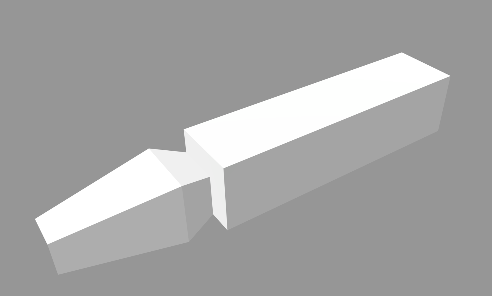

fig left. dogleg corner front &nbsp;&nbsp;&nbsp; fig right. dogleg corner back
2. Generated hilbert curve with dogleg but the sides are not matched.

### Plans for tomorrow:
1. Keep making the flip side corner. 
2. <del>2. Try to generate hilbert curve with dogleg.</del>
3. Match hilbert sides.

### Sidetracks:
* Summer swimming
* Hang out with the group

## 21/06-2022
### Plans:
1. Make corners with different side matches.
2. Generate hilbert wall with new design or restrictions of faces

### Did:
1. Made other corners.
2. Generated new wall with restrictions. Be cautious with .add() to workplane, will duplacte.

  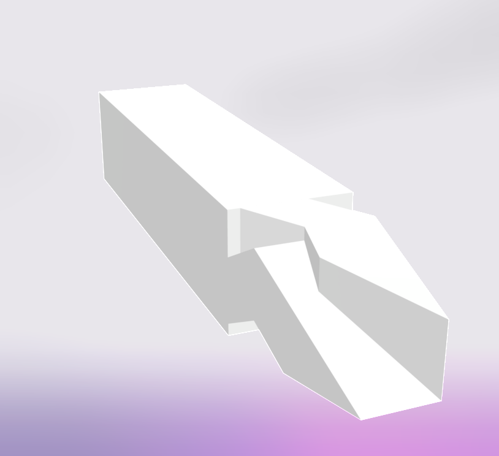
  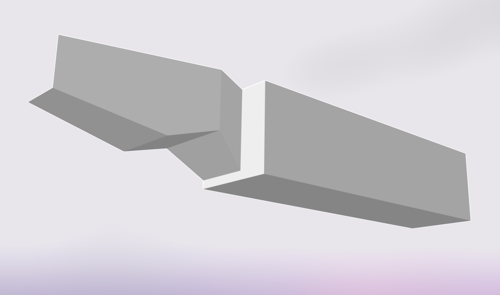

fig left. dogleg corner front with fixed faces. &nbsp;&nbsp;&nbsp; fig right. dogleg corner back with fixed faces.
3. Generated cross pattern walls made by accidant before. 

  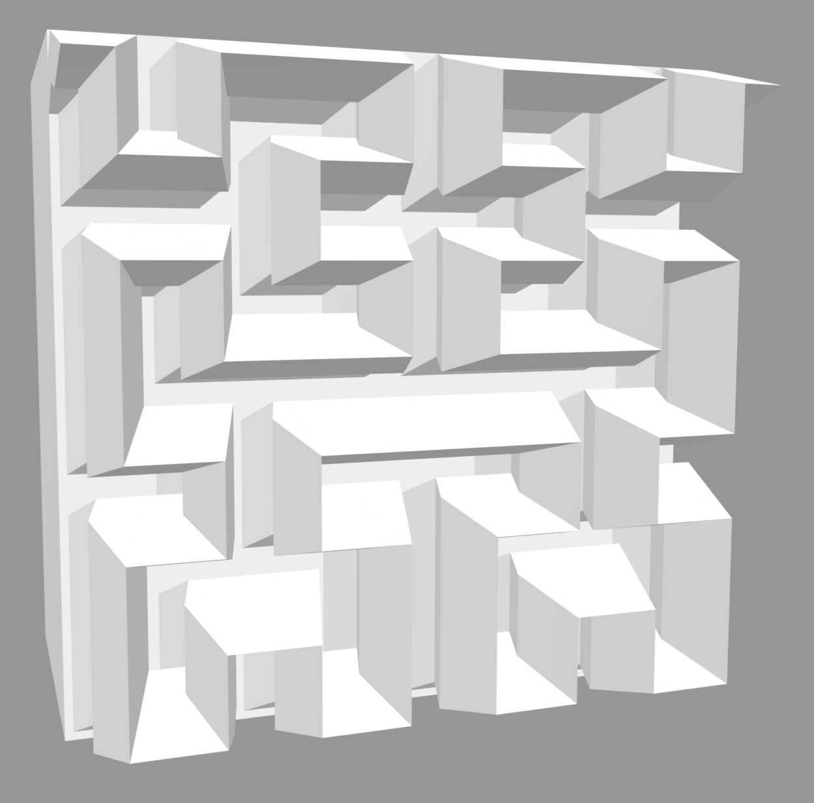
  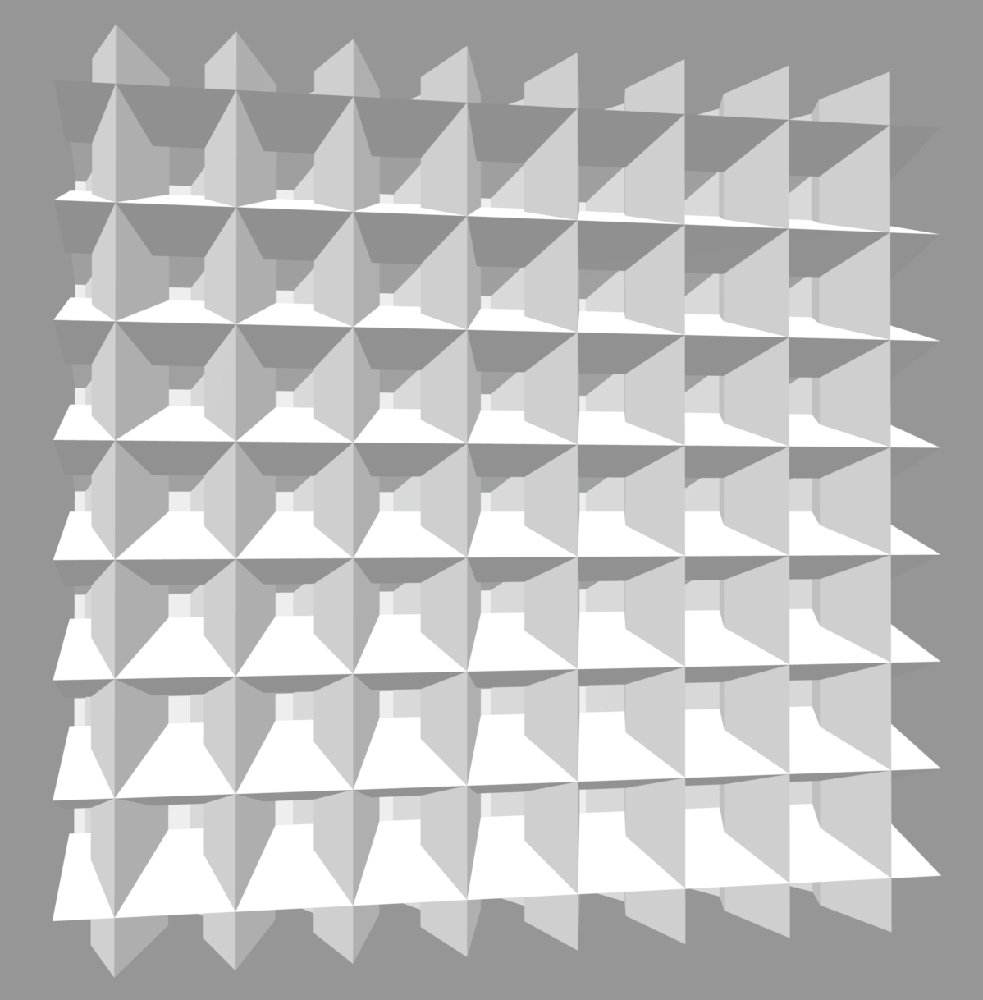

fig left. hilbert curve walls with fixed dogleg cross section. &nbsp;&nbsp;&nbsp; fig right. crossed pattern with dogleg cross section.

### Plans for tomorrow:
1. Generate with fractals, shrink size.

## 21/06-2022
### Plans:
1. Print the two absorber prototypes.
2. Cut holes in dogleg section.
3. Read about resins.
4. Look into fractal scaling patterns.

### Did: 
1. Printed one absorber, the other one is on the way.

  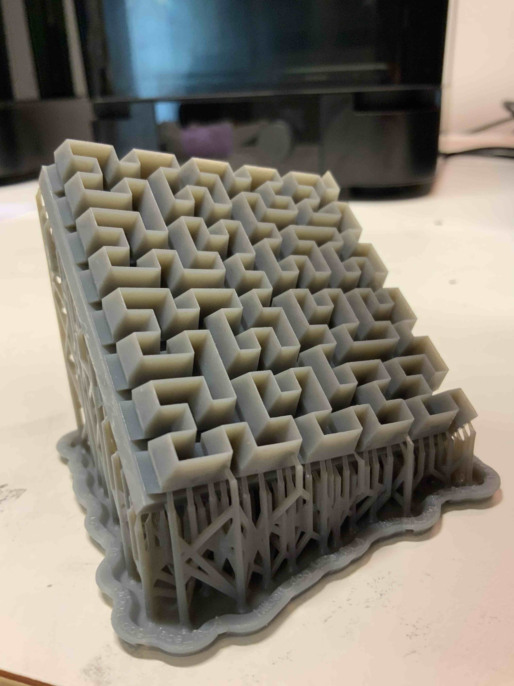
  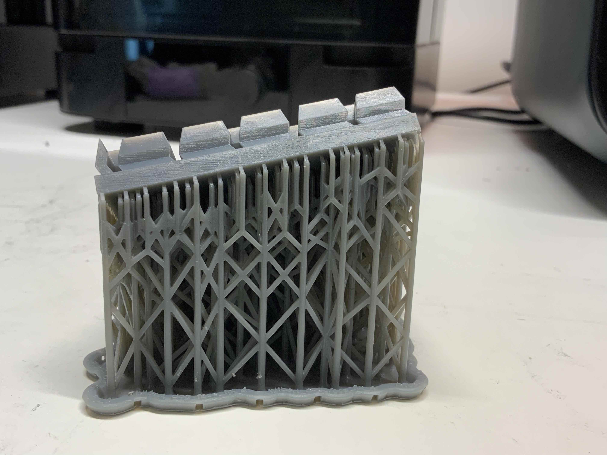

fig left. Hilbert curve walls with fixed dogleg cross section front. &nbsp;&nbsp;&nbsp; fig right. Hilbert curve walls with fixed dogleg cross section side.

3. Read a little bit about ESD resins.
2. Need to scale up the dogleg cross section to minimize the gap between walls. There are bugs going out of the tile size. There are two options: one is to fit the wall inside the tile but shift it, it will be no geometrical bugs but it will be more difficult to generate the whole absorber and have same distance between tops. The second option is to have top centered cross sections but the geometry will go out of tiles which is buggy, it will be easier to generate and make holes.

### Plans for next week:
1. Debugg to make smaller gaps and implement holes.
2. Start develope the resin.
3. Might be worth to make pyramid dog leg to compare.

## 27/06-2022

### Plans: 
1. Continue debug to add implement gap/hole.
2. Read papers on metamaterial absorbers.

### Did: 
1. Made the gaps closer to not get one reflection of flat vertical ground.
2. Implemented holes but it got lots of bugs.
3. Made extended legs down to fix some bugs but the geometry of hole might be wrong.
 

  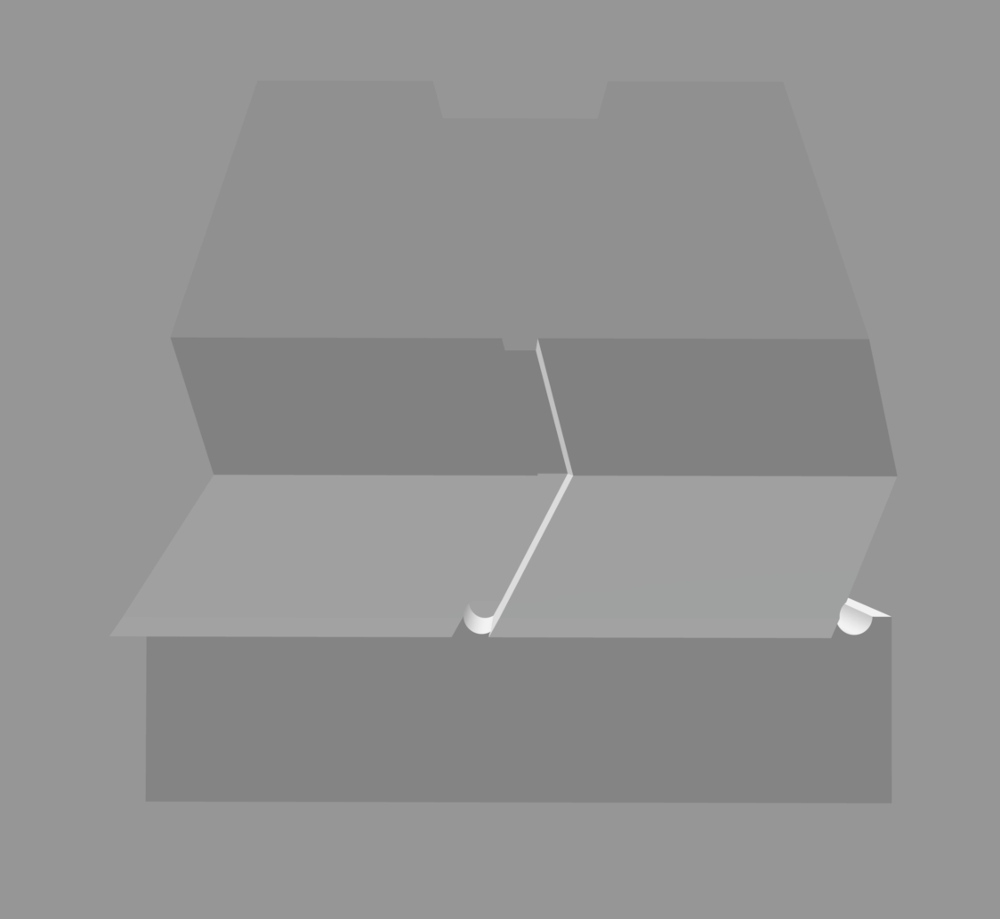
  

fig left. Hilbert with extended sections but with bug. &nbsp;&nbsp;&nbsp; fig right. Wall with flat side is higher than some holes which gets blocked.

### Plans for tomorrow:
1. Cut off hole foundation to edges blocking.
2. fix overlap with hole. 1. might fix this too but look at the geometry.

## 28/06-2022

### Plans: 
1. Put the holes above ground to test. (Center between walls)
2. Read papaers

### Did: 
1. Calculated all geometries to do a remake of dogleg.
* Points so that the hole will fit excatly between walls and excatly above ground so that it does not block anything.
* Have the hole divided in half to smoothly tranision to ground so that it does not block.
2. Drew out the geometries with turtle graphics in Python.
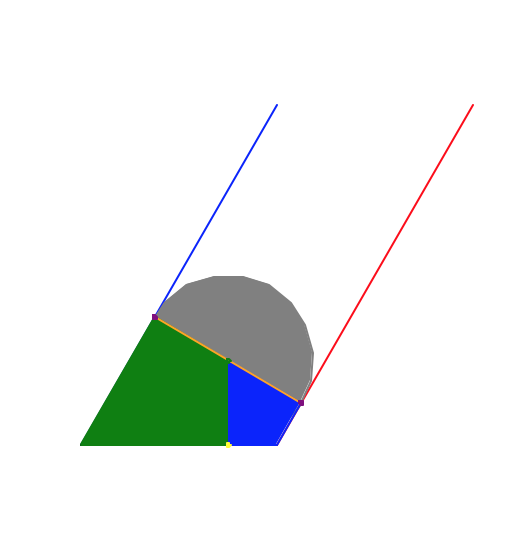
fig. Test drawing with turtle.
3. Fixed an unnoticed bug where the lowest points on the dogleg geometry was wrong because I though that tan(2a) = 2tan(a). Which is now fixed.
4. Added first step of the new dogleg wall with dogleg + added areas.
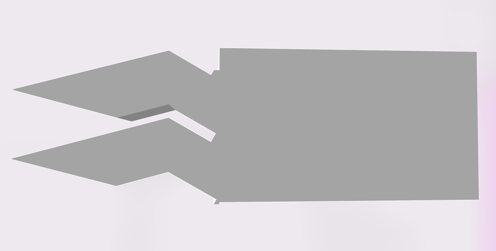
fig. dogleg + added area

## 29/06-2022

### Plans: 
1. Finish the code for new design.
2. Start to print the new design.
3. Read different papers.

### Did:
1. Finished the code.
 

  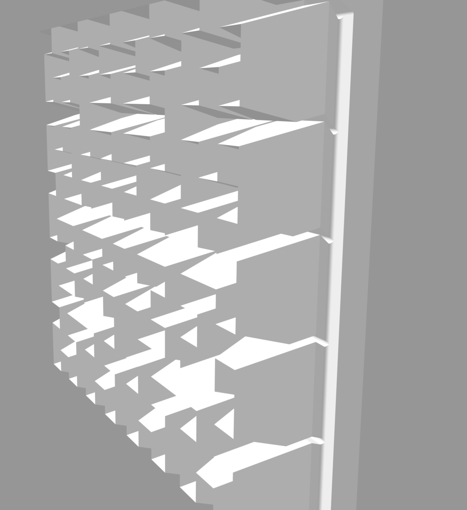
  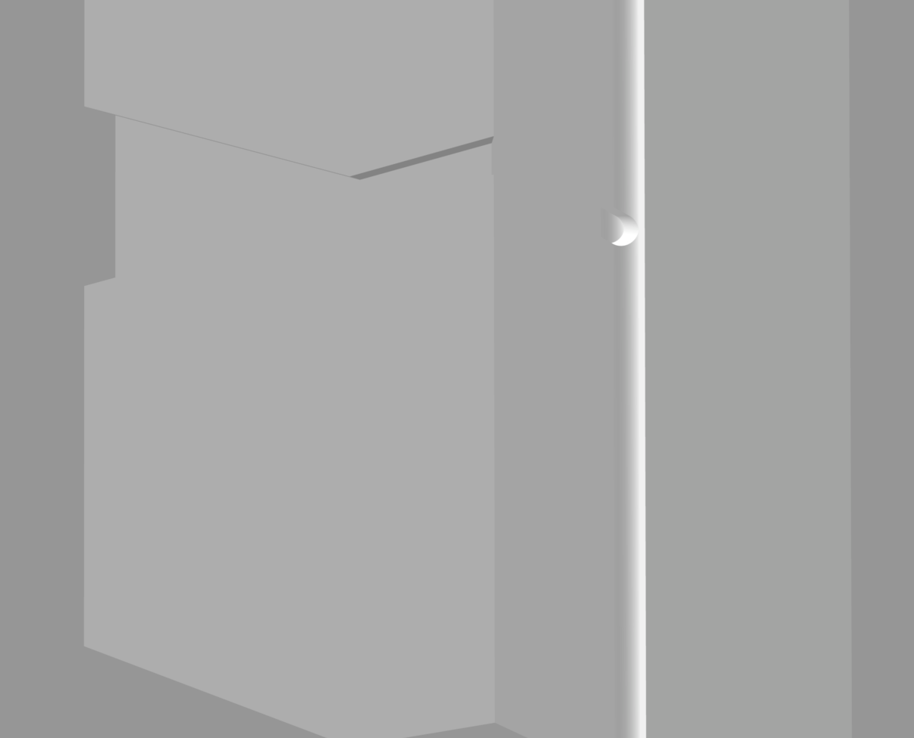

fig left. New design. &nbsp;&nbsp;&nbsp; fig right. New design from side. 

2. Started the print.
3. Error with printer which is now fixed, changing resin type from grey to clear.
4. Preparing and looking through different papers and about 3D-printing

## 30/06-2022

### Plans: 
1. Take out prints and print a larger copy.
2. Read Wollack, Petroff and Gupta papers.

### Did:
1. Took out prints and started to print a larger copy.
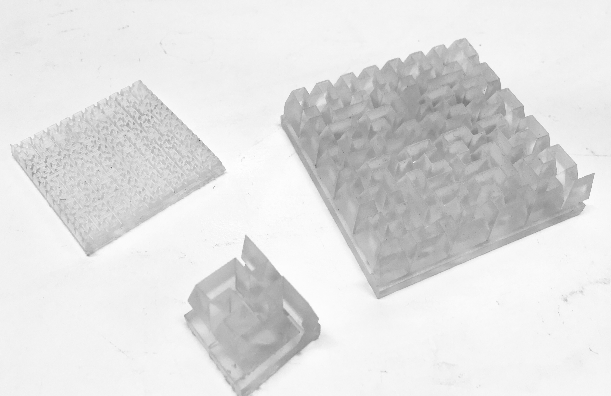
fig. new design absorber, dogleg with holes.
2. Read:
* Wollack
* Petroff
3. Wrote code to generate pyramid abosorber but with dogleg geometry.

### Questions:
1. How do you measure specular vs diffusive reflectance of a material? Is the specular material sanded?
2. Why have dielectric on high conductive substrate?

## 01/07-2022

### Plans: 
1. Still waiting for mixer to arrive. Print the pyramid_dogleg absorber.
2. Read Gupta, other papers and resin.
3. Look at CST tutorials

### Did:
1. Printed larger dogleg and printing pyramid pattern.

fig. new larger hilbert print.
2. Read Gupta and looked at papers on combining Grahpene with liquid photopolymer. 
3. Tested to solidify resins with Formlabs curing machine and it worked (even though support said not to do it).

## Weekly plan:
1. Read papers
2. Mixing 
* Start to test mixing with graphene and iron powder manually (if mixer don't arrive)
* Do different mixs, read about rein and binder.
3. Use the customized resin in a universal cartridge to try print. Look at software which was quite easy to use.
4. CST simulation
5. Measurement methods:
* Ohm resistance measurement
* Use mirrors and horns + larger horns
* Use reflectometer
6. Set up reflectometry:
* Table
* Models and solidworks
* VNA calibration, setup and python code for extracting data (IO)
7. Mixer

## 04/07-2022

### Plans:
1. Look at the order and compare with papers.  
<del> 2. Look into CST or mixing with iron powder. </del>
2. Try to read around 15 pages of papers. (28 per day)

## Did:
1. Send a mail to ask about the Graphene.
2. Read about 10 pages in Staggs and planned to test resin composites.

fig. spike absorber with dogleg as seen in one paper.

## 05/07-2022

### Plans:
1. Look into graphite 325 microns (looked at graphene earlier but it is graphite).
2. Continue read papers, try to skip too difficult parts and focus on the methodology and things related to this project.

## 06/07-2022

### Plans:
1. Cad in soliworks for reflectrometry.

### Did:
1. Cleaned print plate and tank film of failed print.
2. Started cadding and learning Solidworks
3. Finished two parts for one component

## 07/07-2022

### Plans:
1. Learn PyVISA and read VNA manual to export result or trace.

### Did:
1. Skeched the design for fastening a instrument part.
2. Looked into and read about PyVISA, VISA and RS ZNA VNA.

### Other:
1. Needed to help my girlfriend to lost quite much time today. Sorry for that.

## 08/07-2022

### Plans:
1. Take out prints.
2. Look into VNA I/O with Python.

### Did:
1. Finished printing some parts which had some failures. Analysed the failures which is caused by small tips on support.
2. Planning and discussed about mixing resin.
3. Read about VNA connections and connected VNA to Mac and used Pycharm to extract results.

## Weekly plan
1. Start testing diffrent mixtures.
2. Try to understand VNA code and make improvements on sweep time, and plots.
3. Read more papers. 
4. Finish Solidworks parts and make new designs.
5. Make a presentation.

## 11/07-2022
### Plans:
1. Try to understand VNA code and make improvements on sweep time, and plots.

### Did:
1. Tested mixing. Fliud too viscious.
2. Don't make continues sweeps, only single sweeps to avoid overlaping measurements.
3. Read the whole documentation but not the SCPI commands.
4. Seems like max sweep points is 99999.
5. Finished reading the whole documentation for RSinstrument.

### Questions:
1. Is sweep step size fixed to 10 kHz or defined?
2. Is sweeps on the whole range or defined range?
3. What are the other SCPI commands.
4. How do I wait for a single sweep or sync? \*WAI or with_opc? Still stops after 1/10 of sweep.
5. Calculate sweep time?
6. Calibration.
7. Does the instrument take one sweep values (then stops) with cont and opc or should it be cont of and opc? The sweep stops early with cont off.

### Plans for tomorrow:
1. Look at SCPI commands. Difference between end sequens and not.
2. Try to export in single large binary array.
3. Test cont sweep without closing or stopping at the same interval. Export values after each sweep.

## 12/07-2022
### Plans:
1. Look into SCPI commands.
2. Check out more examples.

### Did:
1. Tested and compared different reads from the VNA to see if sweep reads are overlapped. Does not seemed to be overlapping.
2. Fixed Solidworks and modified parts to start priting.
3. Started to look at SCPI commands in manual and testing different commands.

### Other:
1. Family visitation.

## 13/07-2022
### Plans:
1. Testing different mixtures of resin.
2. Read more about SCPI commands.

### Did: 
1. Tried to help debug RoboDK, it seems like robot defines points differently than simulation while trying to move linearly. Posted a thread to get support. Also tried to connect to robot remotly.
2. 
* Read papers about mixing 3d resin with graphite and metal powder. It seems like graphite has higher conductivity yield than iron oxide powder. 
* In the papers, they tested up to 3% w/w and it was not enough to conduct. 
* There was another paper on graphite nanoplatelets and with 50% w/w, it could conduct.
* High w/w percentage with not be sufficiently adhesive to the print plate, they tried with formlabs sla in the paper. 

3. Cured and measured 5% w/w of graphite. Not enough percentage of graphite to conduct. Will test with 25% w/w.

### Plans for VNA:
1. Save and load the setup. #See RsInstrument_ZNx_Save_Load_Setups_From_And_To_PC
2. Use the calibration files. #See RsInstrument_ZNB_CAL_P1_Save_Reload.py
-- Try to not reset session each time, try to cont sweep and take one sweep each time. Pause until saves.
3. Do a sweep and save file to PC. #See RsInstrument_ZNB_S21_Magnitude_write_to_csv.py
4. Loop step 3 without to reset session. #Find how to get data from singles sweeps with cont sweep. Data should not overlap.

## 14/07-2022
### Did: 
1. Make fastner bases for Md4a component in Solidworks.
2. Kept trying to debug the robot.
3. Mixed 25% w/w graphite powder and measured no resistance. Also tried to manually mix with iron powder 5% w/w but no reasistance.

## 15/07-2022
### Did:
1. Finished fastner lock for Md4a component in Solidworks.
2. Discussed robot bug with config file and files.

## Plans after vacation:
1. Measurements with VNA, contious sweep data in binary or ascii.
2. Reflectrometry rotation measurements combined with VNA data extraction and saving data.
3. Finish parts for antenna to start measureing W-band. W-band guider.  

## 01/08-2022
### Plans:
1. Make clamps to sender.
2. Make clamps to receiver.

### Did:
1. Designed mounting base to adjustable module for both mw transmitter and receiver.
2. Designed mounting piece for transmitter to adjustable module.
3. Started designing mounting piece for receiver mount.
4. Began printing parts for transmitter. They will finish tomorrow at 13:00.

## Overall plan for this week
<del> 1. Design components to perform waveguide measurements.</del>  
2. Work on aligning source and receiver.  
3. Test existing tiles in reflectometry system.  
4. Set up system and extract trace info via Python.  
* S21 extraction
* Interval choosing
* Calibration setting
* Write to ASCII or Binary in single file
* Find maximum
* Get magnitude for a specific point. 
5. Make a presentation on progress made.  
(6. Report on code generating code in Python.  
7. Design mount system for Chicago metamataerial absorbers 15x15 cm plate.)  
8. Further alignment of setup.

## 02/08-2022

### Did:
1. Parts failed to print, making a new try.
2. Designed the rest of the parts for receiver.
3. Looked at VNA documentation.

## 03/08-2022

### Plans:
* Set up system and extract trace info via Python
1. S21 extraction
2. Interval choosing
3. Calibration setting
4. Write to ASCII or Binary in single file
5. Find maximum
6. Get magnitude for a specific point
7. Save and load file to PC
8. Single sweeps and cont sweeps (later integrated with export of data)

### Did:
1. Reading documentation for VNA. Started to write VNA notes to learn VNA SCPI commands. Looked at the CALC section.
2. Printed and prepared parts for Static system so that we'll be ready to mount them tomorrow. 

### Other:
Meeting for overview and papers of the CMBeam project group.

## 04/08-2022

### Did:
1. Setup the static reflectometry system. 
2. Looked into documentation of VNA.

## 05/08-2022

### Plans:
1. Upload and save measurement setup between pc and instrument.
2. Extract traces from instrument with configured setup.

### Did:
1. Able to import and export measure setup to PC.
2. Able to extract instrument with config setup.
3. Able to sync with precision.
4. Able to extract two traces at the same time.
5. Able to average traces between n sweeps.

### Other:
1. Go to apple store with Gagan

## Plans for this week:
1. Rewrite Python code on geometry generation.
2. Add code wiki on geometry.
3. Make a presentation.

## 08/08-2022

### Plan:
1. Make cleaner Python code on geometry gen.
* Look through code
* Mabye divide the program to use all with different cross sections.
* Add documentation
* Add code comments
* Add return/output comments
2. At the same time write a code wiki on program/lines of code. (Just link to repo)
* Add link to the important files
* Add download instruction on cadquery

### Did:
1. Started to add in the readme file, added lincense to share. 
2. Looking up and thinking through what to add in repo and code
3. Updated VNA code for average trace
4. Updated Miniconda to keep using cadquery because cadquery need newest verion of OCP.
