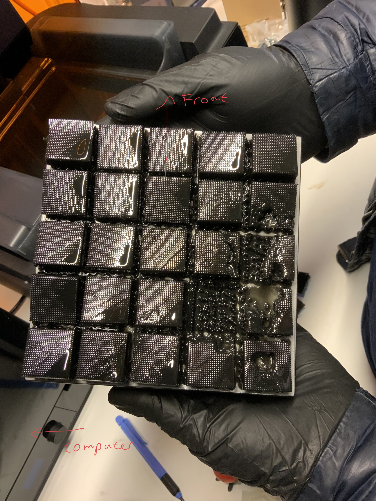
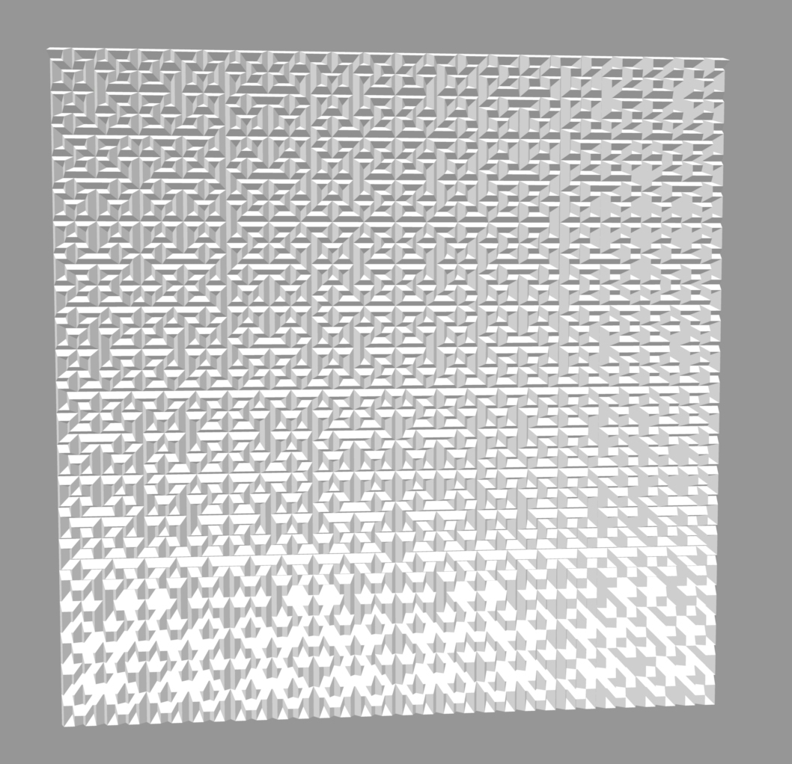
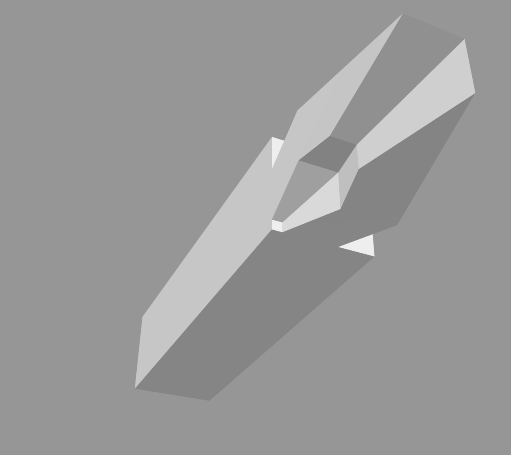
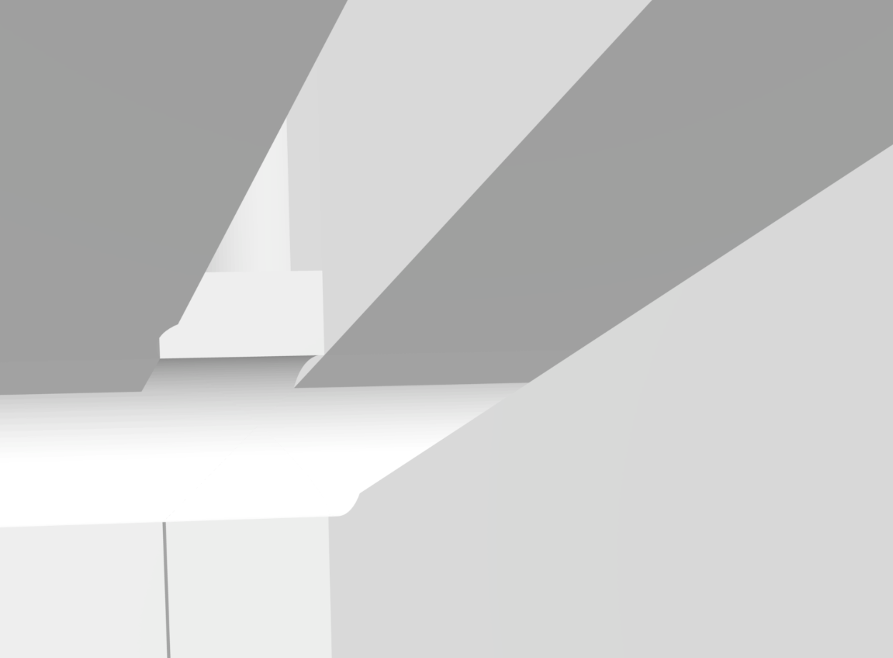

# Metamaterial_absorber

##
## **Preparations**
##

## 20/04-22
1. Setting up git repository and downloading necessary software and documents to prepare for the project.
* Added old_files folder to repo
* Installed Freecad and added Cadquery extension

## 21/04-22
* Set up the correct enviroment to run absorber codes with Cadquery2 with Conda
* Tested the step files with Freecad 0.19

##
## **Official start**
##
## 13/06-22
### Plan:
1. Try 3D-printing something
2. Start learning about cadquery methods 
3. Start to make basic geometries

### Did: 
1. Printed a violin test model and learned to: 
* Send things to formlabs printer via preform. 
* Preparing the printer for printing and removing the print.
* Washing in isopropanol manually and with machine and also curing it.

fig. testprint of violin. (Violin did not hold, really fragile)

2. Looked at different examples of basic geometries of different cadquery objects.
* Learned basic methods in cadquery.

3. Tried to make a basic pyramid.

### Questions \& To do:
* Learn to refill the printer with liquid.
* Learn how to move and rotate in Cadquery workplane to start iterating. (Look into .add, .rotate, .union, .translate methods)

## 14/06-22

### Plan:
1. Learn .translation, <del>.rotation</del>, .add methods
2. Make a 9x9 pyramid absorber
<del> 3. Make a dogleg absorber </del>
4. Try other patterns (Hilbert, translation + rotation)
* start with simple cross section, (rectangular --> triangular --> dogleg)
* start with small section --> larger hilbert curves

### Did: 
1. Looked at many example codes and learned to use methods .add and .translation.
2. Printed out a 30x30 pyramid wall with 1 mm between pyramids. 

Figure1. print of pyramid wall from the side.  

Figure2. print of pyramid wall from above.  

3. Started to print 25 25x25 updated pyramid walls to check printer properties.

### Questions and to do:
* What is/ how to make different types: Workplane, solid
* Some parts of the prints gets deformed, also pyramid heads are not sharp in different regions. Some supports are missing and noise during print.
* We could make some test patterns and print those 3-5 times to see if deformation happen on same spot or different.

## 15/06-22

### Plan:
1. Study the print.
2. Finish writing the geometry file, add dog_leg later.
3. Start making Hilbert curve with blocks, continue to pyramid which requires corner sections, etc.

### Did:
1. We studies the print and looks like the print is very dependent on the film quality and condition. We should change to a new film for optimal prints. The metal plating seemed fine. 

  

fig. printed lots of absorbers to fit the printing plate to check deformations.

2. Finished the geometry class file and also written in functions depending on use, class is more difficult to use.

3. Written the code to generate hilbert curves with L-system and drawed it with turtle. I'll continue with integrate it with walls.

fig. generated hilbert curve with turtle graphics.

### To do:
1. have code divided by the classes: cross_section, wall_segments, pattern 

### Comment:
1. Print with tilted objects so that the vertikal lines don't deform as easily. 

## 16/06-2022
### Plans:
1. Create different wall section, start with <del>rectangular</del> (no need because of overlap) and triangular. (doubble symmetry vs single symmetry vs no symmetry (dogleg))
<del> 2. Integreate block cross sections with hilbert curve generation. </del>
3. Continue with trangular cross section.
4. Design corner and side wall section for dogleg .
5. Integrate dogleg with hilbert curve. (start with one sided and later matched sides)

### Did:
1. Wrote code to create wall side and corner for triangular cross section.
3. Integrated it with hilbert generating code prepared for printing.

fig. generated hilbert curve as stl file.

## 17/06-2022
### Plans: 
1. Print the hilbert curve prototype
2. Restructure the code
3. <del>Start workig with the dogleg cross section in two parts.</del> (Hilbert curve not needed, easier to make other patterns?)
4. Test and look at corner section to see potential problems.

### Did:
1. Printed the print which looks good.

fig. printed out hilbert curve.

2. I've now restructured the code to add modification and more pattern/cross section. 
The corner build might need modification for more complicated cross sections

### Plans for next week:
1. Look at dogleg corners or rotations and look at potential problem or solution.

## 20/06-2022
### Plans:
1. Read the dogleg papaer.
2. Make dogleg side and then corner
3. Read meta absorber paper from Gagan

### Did:
1. Looked through dogleg design and will continue reading details later.
2. Made dogleg side but still working on corner

  
  
  

fig left. dogleg intersection. &nbsp;&nbsp;&nbsp; fig mid. dogleg side &nbsp;&nbsp;&nbsp; fig right. dogleg hilbert curve but bugged

### Questions:
1. The corners are quite buggy, try to fix next time
2. Shift the tiles to correct for deformation. Could be done with tangent, angle and loft but problem when the height collides with other tiles.

### Sidetracks:
* Jessica Meir presentation.

## 21/06-2022
### Plans:
1. Continue to make dogleg corner shapes.

### Did:
1. Successfully made one variant of the dogleg corners. 

  
  

fig left. dogleg corner front &nbsp;&nbsp;&nbsp; fig right. dogleg corner back
2. Generated hilbert curve with dogleg but the sides are not matched.

### Plans for tomorrow:
1. Keep making the flip side corner. 
2. <del>2. Try to generate hilbert curve with dogleg.</del>
3. Match hilbert sides.

### Sidetracks:
* Summer swimming
* Hang out with the group

## 21/06-2022
### Plans:
1. Make corners with different side matches.
2. Generate hilbert wall with new design or restrictions of faces

### Did:
1. Made other corners.
2. Generated new wall with restrictions. Be cautious with .add() to workplane, will duplacte.

  
  

fig left. dogleg corner front with fixed faces. &nbsp;&nbsp;&nbsp; fig right. dogleg corner back with fixed faces.
3. Generated cross pattern walls made by accidant before. 

  
  

fig left. hilbert curve walls with fixed dogleg cross section. &nbsp;&nbsp;&nbsp; fig right. crossed pattern with dogleg cross section.

### Plans for tomorrow:
1. Generate with fractals, shrink size.

## 21/06-2022
### Plans:
1. Print the two absorber prototypes.
2. Cut holes in dogleg section.
3. Read about resins.
4. Look into fractal scaling patterns.

### Did: 
1. Printed one absorber, the other one is on the way.

  
  

fig left. Hilbert curve walls with fixed dogleg cross section front. &nbsp;&nbsp;&nbsp; fig right. Hilbert curve walls with fixed dogleg cross section side.

3. Read a little bit about ESD resins.
2. Need to scale up the dogleg cross section to minimize the gap between walls. There are bugs going out of the tile size. There are two options: one is to fit the wall inside the tile but shift it, it will be no geometrical bugs but it will be more difficult to generate the whole absorber and have same distance between tops. The second option is to have top centered cross sections but the geometry will go out of tiles which is buggy, it will be easier to generate and make holes.

### Plans for next week:
1. Debugg to make smaller gaps and implement holes.
2. Start develope the resin.
3. Might be worth to make pyramid dog leg to compare.

## 27/06-2022

### Plans: 
1. Continue debug to add implement gap/hole.
2. Read papers on metamaterial absorbers.

### Did: 
1. Made the gaps closer to not get one reflection of flat vertical ground.
2. Implemented holes but it got lots of bugs.
3. Made extended legs down to fix some bugs but the geometry of hole might be wrong.
 

  
  

fig left. Hilbert with extended sections but with bug. &nbsp;&nbsp;&nbsp; fig right. Wall with flat side is higher than some holes which gets blocked.

### Plans for tomorrow:
1. Cut off hole foundation to edges blocking.
2. fix overlap with hole. 1. might fix this too but look at the geometry.

## 28/06-2022

### Plans: 
1. Put the holes above ground to test. (Center between walls)
2. Read papaers

### Did: 
1. Calculated all geometries to do a remake of dogleg.
* Points so that the hole will fit excatly between walls and excatly above ground so that it does not block anything.
* Have the hole divided in half to smoothly tranision to ground so that it does not block.
2. Drew out the geometries with turtle graphics in Python.

fig. Test drawing with turtle.
3. Fixed an unnoticed bug where the lowest points on the dogleg geometry was wrong because I though that tan(2a) = 2tan(a). Which is now fixed.
4. Added first step of the new dogleg wall with dogleg + added areas.

fig. dogleg + added area

## 29/06-2022

### Plans: 
1. Finish the code for new design.
2. Start to print the new design.
3. Read different papers.

### Did:
1. Finished the code.
 

  
  

fig left. New design. &nbsp;&nbsp;&nbsp; fig right. New design from side. 

2. Started the print.
3. Error with printer which is now fixed, changing resin type from grey to clear.
4. Preparing and looking through different papers and about 3D-printing

## 30/06-2022

### Plans: 
1. Take out prints and print a larger copy.
2. Read Wollack, Petroff and Gupta papers.

### Did:
1. Took out prints and started to print a larger copy.
2. Read Wollack

### Questions:
1. How do you measure specular vs diffusive reflectance of a material? Is the specular material sanded?
2. Why have dielectric on high conductive substrate?
