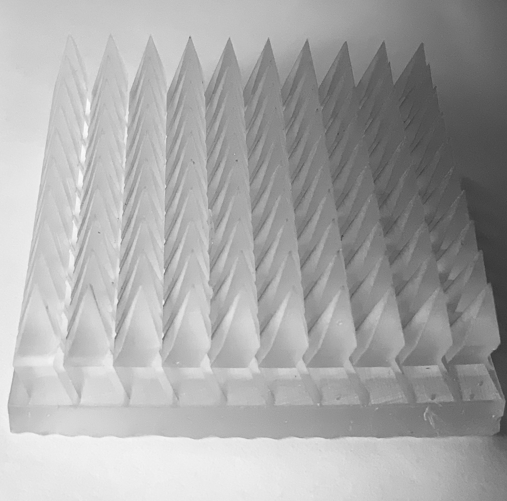
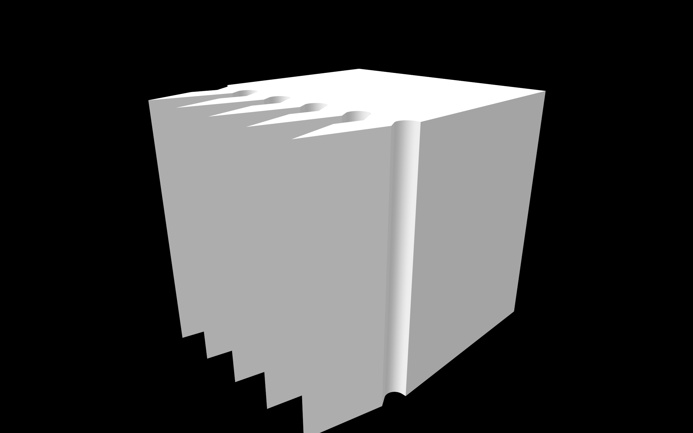
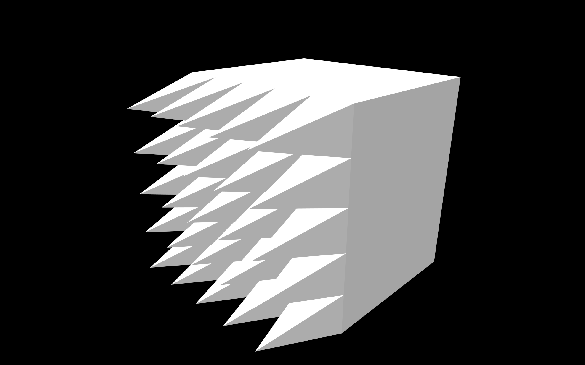
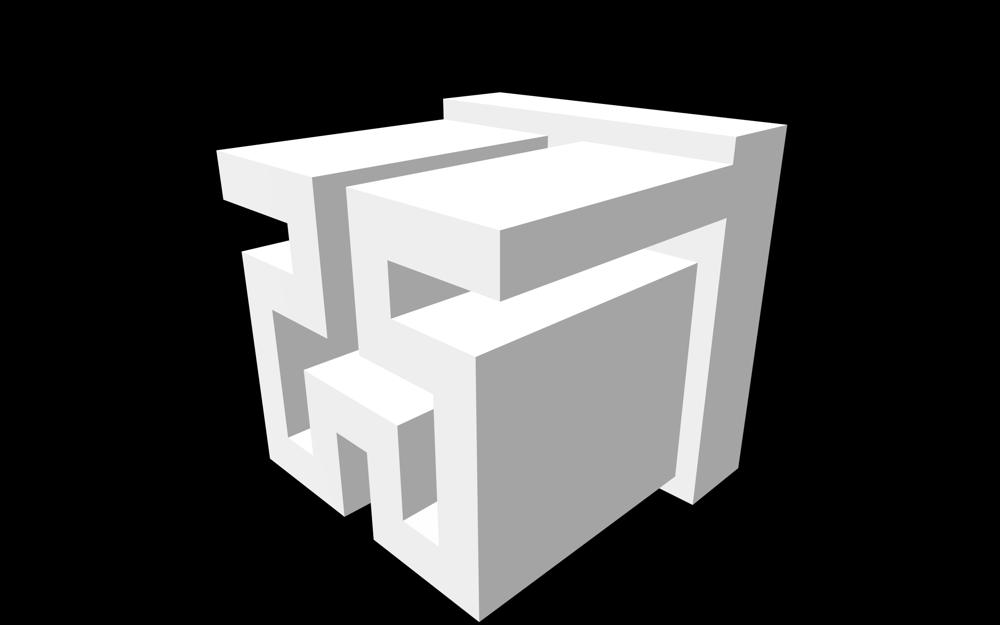

# Metamaterial Absorber

## Overview

A metamaterial absorber generator with configurable wall cross-sections and patterns. The core package builds CadQuery workplanes and exports STL files for 3D printing.

||
|:--:|
| *Figure 1. Example 3D print of generated STL file.* |

|   |  | |
|:---:|:---:|:---:|
|Figure 2. Dogleg rows absorber| Figure 3. Triangle dots absorber|Figure 4. Block hilbert example|

## Features

- Modular Python package under `src/` (easy to import and test).
- Pattern generators: vertical rows, dots, and Hilbert curve.
- Cross-sections: dogleg, triangle, and block.
- CLI for quick STL generation.
- CI pipeline for linting, tests, and build checks.

## Quickstart

### 1) Create an environment

CadQuery is easiest to install with conda:

```
conda create -n memab python=3.11
conda activate memab
conda install -c conda-forge cadquery
```

### 2) Install the package

```
python -m pip install -e .
```

If you are installing CadQuery via pip instead of conda, use the extra:

```
python -m pip install -e ".[cadquery]"
```

### 3) Generate an STL

```
metamaterial-absorber --pattern dots --cross-section triangle --pattern-len 5 --pattern-wid 5
```

The output filename is auto-generated unless you pass `--output`.

## Python API

```python
from metamaterial_absorber import Absorber, Pattern, Wall

wall = Wall(cross_section="dogleg", tile_height=3.0, export=False)
pattern = Pattern()
pattern.create_ver_rows_blueprint(pattern_len=8, pattern_wid=4, scale=1.0)

absorber = Absorber(wall, pattern)
absorber.build()
absorber.export("dogleg_rows.stl")
```

## Development

```
python -m pip install -e ".[dev]"
python -m ruff check .
python -m ruff format .
python -m pytest -q
```

## CI/CD

GitHub Actions runs on every push and pull request:
- Ruff lint
- Ruff format check
- Pytest
- Package build check
- CadQuery geometry tests (conda-forge)

Workflow: `.github/workflows/ci.yml`

## Repository layout

- `src/metamaterial_absorber/`: production package code.
- `tests/`: unit tests for pattern generation and tile logic.
- `examples/`: sample scripts (optional).
- `examples/README.md`: how to run the examples.

## Documentation

- `Documentation.md` for deeper background and design notes.
- `archive/History_log.md` for project history.
- `Metamaterial_absorber_presentation_Zeshen_Bao.pdf` for a project overview.

## Roadmap

- The public API is intended to be stable.
- Version numbers adhere to semantic versioning.

Zeshen Bao - https://github.com/zeshenbao
